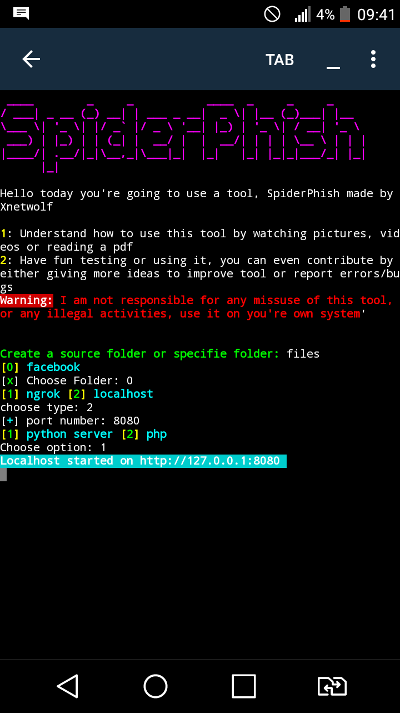
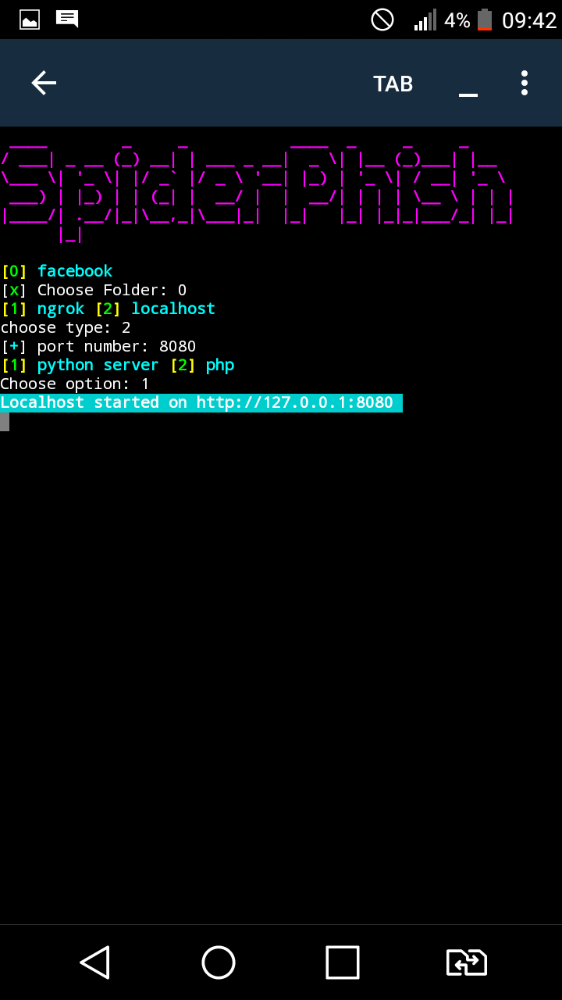

## SpiderPhish

## On first launch

## on second launch

Note: `files`folder only contains facebook phishing pages while testing it
This is an open source phishing made using python and has a more complex style
instead of if elif else and also instead of having to hardcoded the folders path of html files...

## Getting Started

1. Run `main.py` and follow the instructions on screen 

### Prerequisites

You will need:

* [Python 3.6+](https://www.python.org/downloads) (Make sure to add python to PATH during installation)
* A Windows/Linux Computer
* Can be run on terminal emulator such as termux...

1. Download the repository via github or git 
`git clone https://github.com/Xnetwolf/SpiderPhish`
2. install the required by running `./install.sh`
3. run the tool `python main.py`

Follow these step for easy setup(copy paste)
`
1. git clone https://github.com/Xnetwolf/SpiderPhish
2. cd SpiderPhish
3. chmod +× *
4. ./install.sh

### Installing

1. Download the prerequisites(python, spiderphish and requirements)
 Type in terminal
2. `python main.py`

## Running the tests

To run the tests create a directory in which you include many other directories that contain you html

like that:
direcotory_
|_facebook
|  |_ index.html
|_instagram

run it in localhost mode to test it after using ngrok

## Built With

*[Python 3.6+](https://www.python.org/download)

## Authors

* **Rad Taren** - *Initial work* - [Xnetwolf](https://github.com/Xnetwolf)

## License

This project is licensed under the MIT License

## Acknowledgments

Used some of his codes
* https://github.com/princekrvert/Asura
